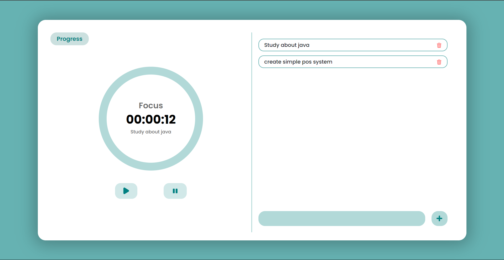

# Task Tracker

## Description
This project is a web application that allows users to manage tasks and track the time spent on each task. It includes a timer, task list, and a chart to visualize task durations.

## Features
- Add, delete, and select tasks
- Timer to track time spent on tasks
- Visualization of task durations using a bar chart

## Technologies Used
- HTML
- CSS (Bootstrap)
- JavaScript (jQuery, Chart.js)

## Setup Instructions
1. Clone the repository.
2. Open `index.html` in a web browser.

## Usage
1. Add tasks using the input field and button.
2. Select a task to focus on.
3. Use the start and stop buttons to track time.
4. Click the "Progress" button to view the task duration chart.

## Dependencies
- [Bootstrap](https://getbootstrap.com/)
- [jQuery](https://jquery.com/)
- [Chart.js](https://www.chartjs.org/)

## License
This project is licensed under the MIT License.
